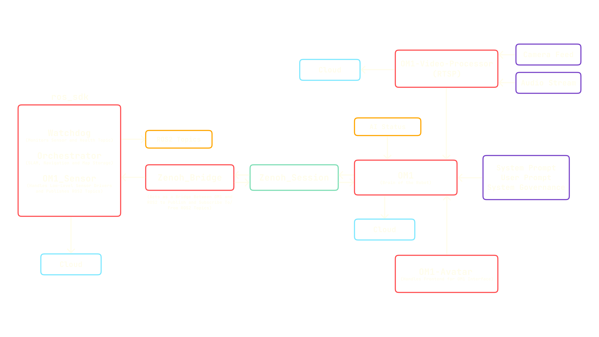

## Core Components
OM1’s full autonomy mode is powered by the following tightly integrated services, each running in its own container and communicating in real time:

### 1. OM1 (`om1`)
The central intelligence of the system, responsible for:
- High-level decision making and behavior planning
- Natural language understanding and generation
- Task planning and execution monitoring
- Integration with external AI services

### 2. Unitree Go2 ROS2 SDK (`unitree_go2_ros2_sdk`)
The robotics middleware that provides:
- Sensor data acquisition and processing
- SLAM (Simultaneous Localization and Mapping)
- Navigation and motion planning
- Low-level robot control

### 3. OM1 Avatar (`om1-avatar`)
Frontend interface components:
- React-based user interface
- Real-time avatar rendering
- System status visualization
- User interaction layer
- Runs on the robot's BackPack screen

### 4. Video Processor (`om1-video-processor`)
Media handling subsystem:
- Camera feed processing
- Face detection and recognition
- Video and audio streaming to RTSP server

## System Architecture
1. Sensor Data Collection
    The unitree_go2_ros2_sdk gathers data from sensors such as LiDAR and cameras, publishing ROS2 topics for localization and mapping.

2. Autonomous Decision-Making
    The om1 agent receives processed sensor data, user and system prompts, system governance and issues commands for navigation, exploration, and interaction, enabling the robot to operate independently.

3. Continuous Monitoring
    The watchdog service within the ROS2 SDK monitors sensor and topic health, automatically restarting components if issues are detected to ensure reliability.

4. User Interaction
    The om1-avatar frontend displays robot avatars, allowing you to interact with your robot in real time via the BackPack screen. It is designed to work in conjunction with OM1 robotics backend systems and hardware components.

5. RTSP Streaming
    The om1-video-processor component streams video and audio data to an RTSP server, enabling real-time video and audio streaming to external systems.

## Getting Started

### Prerequisites
- Docker and Docker Compose installed
- Access to all required repositories
- Proper hardware setup (Unitree Go2 robot)

### Quick Start
1. Clone all required repositories:
   ```bash
   git clone https://github.com/OpenMind/OM1.git
   git clone https://github.com/OpenMind/unitree_go2_ros2_sdk.git
   git clone https://github.com/OpenMind/OM1-avatar.git
   git clone https://github.com/OpenMind/OM1-video-processor.git
   ```

2. Start the core services:
   ```bash
   # Start OM1
   cd OM1
   docker-compose up om1 -d --no-build

   # Start ROS2 SDK components
   cd ../unitree_go2_ros2_sdk
   docker-compose up orchestrator om1_sensor watchdog zenoh_bridge -d --no-build

   # Start Avatar frontend
   cd ../OM1-avatar
   docker-compose up -d --no-build

   # Start Video Processor
   cd ../OM1-video-processor
   docker-compose up -d --no-build
   ```

## What Happens Next

- The BackPack screen will launch the OM1-avatar frontend, providing a live interface for robot status and control.
- The robot will begin autonomous operation, navigating, mapping, and learning from its environment.
- The om1-video-processor streams video and audio data to an RTSP server, enabling real-time video and audio processing.
- You can now interact with your robot through the user interface.

---

Your robot is now ready to accompany you, assist with tasks, explore new environments, and learn alongside you.

Note : We currently support Full autonomy for Unitree Go2 robot.